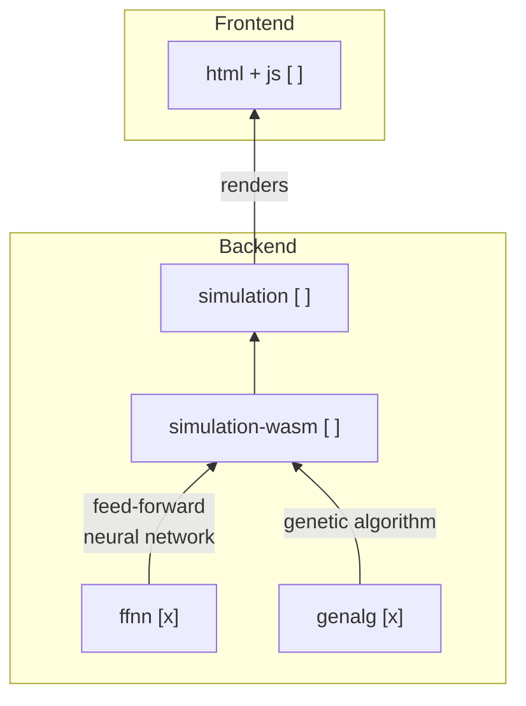

# Notes

**Brief:** _Simulation of evolution using neural network and genetic algorithm._

- [Notes](#notes)
  - [learning-to-fly series](#learning-to-fly-series)
  - [Architecture](#architecture)
  - [TODO](#todo)
  - [References](#references)

## [learning-to-fly](https://pwy.io/posts/learning-to-fly-pt1/) series

- [x] The Domain
- [x] The Neural Network
- [x] The Genetic Algorithm
- [ ] The User Interface

## Architecture

## TODO

- [ ] implement all those functions that'll determine what a bird sees or how a
  bird moves.
  - In addition, for a fearless WebAssembly experience, we'll need two other tools:
    - npm (like Cargo, but for JavaScript),
    - wasm-pack (set of tools that make compiling Rust into WebAssembly easier).

## References

- learning-to-fly series: <https://pwy.io/posts/learning-to-fly-pt1/>
- Go Workspaces: <https://go.dev/doc/tutorial/workspaces>
