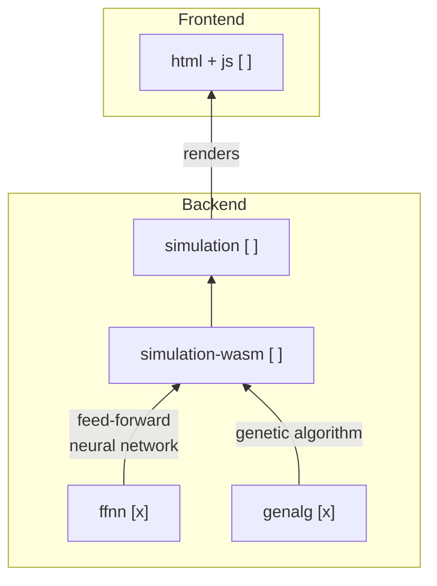

# Notes

**Brief:** _Simulation of evolution using neural network and genetic algorithm._

- [Notes](#notes)
  - [learning-to-fly series](#learning-to-fly-series)
  - [Architecture](#architecture)
  - [TODO](#todo)
  - [References](#references)

## [learning-to-fly](https://pwy.io/posts/learning-to-fly-pt1/) series

- [x] The Domain
- [x] The Neural Network
- [x] The Genetic Algorithm
- [ ] The User Interface

## Architecture

## TODO

- [ ] _implement all those functions that'll determine what a bird sees or how a
  bird moves._
  - _In addition, for a fearless WebAssembly experience, we'll need two other tools:_
    - _npm (like Cargo, but for JavaScript),_
    - _wasm-pack (set of tools that make compiling Rust into WebAssembly easier)._
- [ ] _This is a minor thing that I consider a good practice — by prefixing
  workspace-crates, you reduce the risk of your local crate name-clashing with
  something from crates.io.  
  Say, we're about to create libs/rand — by calling it lib-rand instead of just
  rand, we can avoid confusing other programmers who might stumble upon our code
  in the future._
  
  Similar approaches include:
  - prefixing with project's name (that's what rustc does, for example),
  - prefixing with whatever else you want (e.g. local-foo or crate_foo),
  - not prefixing at all (also valid!).

## References

- learning-to-fly series: <https://pwy.io/posts/learning-to-fly-pt1/>
  - repository: <https://github.com/patryk27/shorelark>
- Go Workspaces: <https://go.dev/doc/tutorial/workspaces>
